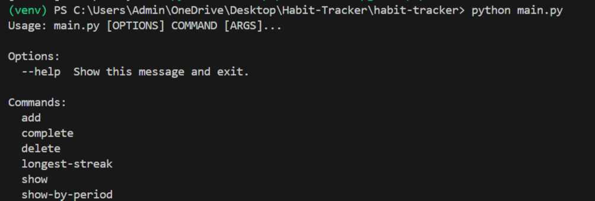

# 📋 IU Habit Tracker App  

A **command-line Python application** to help users track daily and weekly habits, analyze streaks, and stay consistent.  
Built using **Object-Oriented and Functional Programming** with **SQLite** for persistence.

---

## 📑 Table of Contents  
1️⃣ About the Project  
2️⃣ Technologies Used  
3️⃣ Project Structure  
4️⃣ How to Run  
5️⃣ Features  
6️⃣ UML Class Diagram  
7️⃣ Example Usage  
8️⃣ License  

---

## 📌 About the Project  
This CLI-based Habit Tracker allows users to:  
- ✔️ Create, update, and delete daily and weekly habits  
- ✔️ Track progress with completion streaks  
- ✔️ Analyze habits through periodicity filters and reports  
- ✔️ Store all data persistently using SQLite  

---

## 🛠️ Technologies Used  
- **Python 3.11**  
- **SQLite** (Database)  
- **Click** (CLI interaction)  
- **Pytest** (Unit testing)  

---

## 📂 Project Structure  
``` 
habit-tracker/
├── data/
├── src/
│ ├── analytics.py
│ ├── cli.py
│ ├── db.py
│ ├── habit.py
├── tests/
│ ├── test_habit.py
├── main.py
├── README.md
├── requirements.txt
``` 

- `src/`: Core app logic (habit management, CLI, analytics, DB)  
- `tests/`: Unit tests via Pytest  
- `main.py`: Entry point  
- `requirements.txt`: Dependencies  

---

## 🚀 How to Run  

### Step 1: Clone repo  
```bash
git clone https://github.com/Alshifa-siddiqui/habit-tracker.git  
cd habit-tracker
``` 

### Step 2: Create & activate virtual environment
```bash
python -m venv venv  
venv\Scripts\activate    # Windows  
source venv/bin/activate # Mac/Linux  
```

### Step 3: Install dependencies
```bash
pip install -r requirements.txt  
```

### Step 4: Run the app
```bash
python main.py  
```

## 💡 Example CLI Commands
```bash
python main.py add Workout Daily  
python main.py complete Workout  
python main.py show  
python main.py longest-streak  
```
---
✨ Features
---
✔️ Track daily/weekly habits

✔️ Analyze longest streaks

✔️ Filter by periodicity

✔️ Persistent SQLite storage

✔️ CLI with Click

✔️ Unit tests with Pytest

---
### 📝 UML Class Diagram
---


---
📸 Example CLI Output
---


## 📄 License
#### MIT License