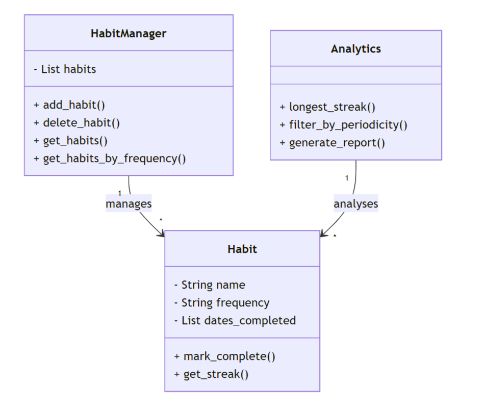
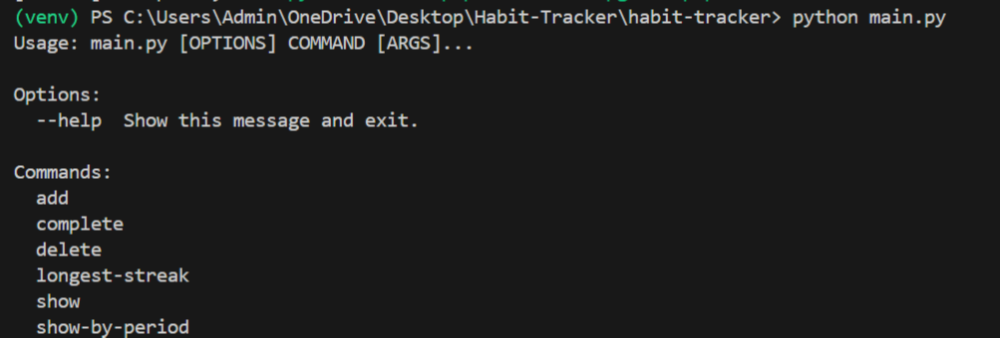

# 📋 Habit Tracker (CLI)

A **command-line Python application** to track daily and weekly habits, record
completions, and analyze streaks. Built with an OOP + functional style and
**SQLite** for persistence.

---

## 📑 Table of Contents
1. [About](#-about)
2. [Tech Stack](#-tech-stack)
3. [Project Structure](#-project-structure)
4. [Installation](#-installation)
5. [Usage](#-usage)
6. [Features](#-features)
7. [Testing](#-testing)
8. [Predefined Sample Data](#-predefined-sample-data)
9. [Diagrams & Screenshots](#-diagrams--screenshots)
10. [Known Limitations](#-known-limitations)
11. [License](#-license)

---

## 📌 About
This CLI Habit Tracker lets you:
- Create and delete daily/weekly habits
- Mark habits complete (incrementing a completion count)
- List habits and filter by periodicity
- Find the habit with the longest streak
- Persist everything in a local SQLite database

---

## 🛠️ Tech Stack
- **Python 3.10+**
- **SQLite** (standard-library `sqlite3`)
- **Click** (CLI framework)
- **Pytest** (tests)

---

## 📂 Project Structure
```
habit-tracker/
├── data/
│   └── habits.db            # shipped SQLite DB with sample data
├── src/
│   ├── __init__.py
│   ├── analytics.py         # read/report queries
│   ├── cli.py               # Click commands (ensures schema on startup)
│   ├── db.py                # connection + schema + writes
│   └── habit.py             # Habit class
├── tests/
│   └── test_habit.py        # pytest suite (isolated temp DBs)
├── assets/
│   ├── UML.png
│   └── CLI/CODE.png
├── .github/workflows/ci.yml # CI: install + tests
├── main.py                  # entry point
├── requirements.txt
├── .gitignore
├── LICENSE
└── README.md
```

---

## 🚀 Installation
```bash
git clone https://github.com/Alshifa-siddiqui/habit-tracker.git
cd habit-tracker
python -m venv venv
# Windows: venv\Scripts\activate     |  macOS/Linux: source venv/bin/activate
pip install -r requirements.txt
```

---

## 💡 Usage
```bash
python main.py add "Workout" Daily       # add a habit
python main.py complete "Workout"        # mark it complete (+1 streak)
python main.py show                       # list all habits
python main.py show-by-period Daily       # filter by periodicity
python main.py longest-streak             # habit with the highest streak
python main.py delete "Workout"           # remove a habit
```
The schema is created automatically on first run, so the app works even if
`data/habits.db` is deleted.

---

## ✨ Features
- Add / complete / delete daily & weekly habits
- List habits and filter by periodicity
- Longest-streak report
- Persistent SQLite storage (auto-created schema)
- Click-based CLI
- Pytest test suite + GitHub Actions CI

---

## 🧪 Testing
```bash
pytest
```
Tests run against isolated temporary databases (they do not touch the shipped
`data/habits.db`).

---

## 📦 Predefined Sample Data
The shipped `data/habits.db` contains:

| Habit | Periodicity | Streak |
|---|---|---|
| Drink Water | Daily | 30 |
| Gym | Weekly | 4 |
| Morning Walk | Daily | 20 |
| Yoga | Weekly | 5 |
| Journal Writing | Daily | 25 |

---

## 📝 Diagrams & Screenshots

**UML Class Diagram**



**Example CLI Output**



---

## ⚠️ Known Limitations
- **Streak is a completion counter, not a date-based streak.** `complete`
  increments `streak` by 1 on each call; it does not verify that completions
  occur on consecutive days/weeks. A date-aware streak engine (using
  `last_completed`) would be a natural enhancement.
- The `Habit` class is currently a thin data holder; CLI commands use direct
  SQL rather than the class.

---

## 📄 License
Released under the [MIT License](LICENSE).
