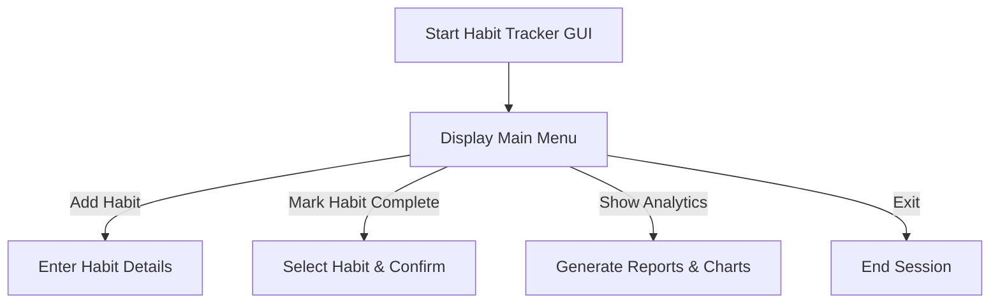
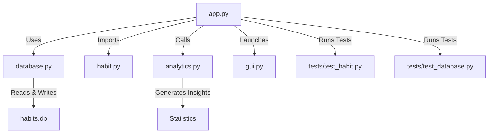

# 📝 **Habit Tracker**  
_A powerful habit-tracking app with analytics and progress tracking._

## 📌 **Introduction**
This project is part of the **"Object-Oriented and Functional Programming with Python"** university course. The **Habit Tracker** allows users to **create, manage, and track their habits** through both a **CLI and GUI interface** while providing **habit analytics** such as streaks, progress visualization, and completion reports.

### **✨ Key Features**
✅ **Track Daily/Weekly/Monthly Habits**  
✅ **View Habit Streaks & Progress Reports**  
✅ **Mark Habits as Completed**  
✅ **Generate Analytics & Charts**  
✅ **Interactive GUI (Tkinter)**  
✅ **SQLite Database for Data Persistence**  
✅ **Unit Testing with Pytest**  

---

## 🏗 **Project Structure**
```sh
habit-tracker/
├── src/
│   ├── app.py                # CLI entry point / main menu
│   ├── database.py           # SQLite data layer (VitalisDB)
│   ├── analytics.py          # Functional analytics: streaks, rates, charts
│   ├── medical.py            # General wellness insights (pure functions)
│   ├── rpg.py                # Gamification: characters, bosses, pets, gear
│   ├── gui.py                # Tkinter desktop UI
│
├── tests/
│   ├── test_database.py      # Data-layer tests (CRUD, check-ins, streaks)
│   ├── test_medical.py       # Wellness insight function tests
│
├── pytest.ini                # Test config (adds src/ to import path)
│
├── docs/                     # Documentation and diagrams
│   ├── user_flowchart.png     # User interaction flowchart
│   ├── component_diagram.png  # Module interaction diagram
│
├── config.json               # Stores configuration settings
├── setup.py                  # Helps with packaging and installation
├── requirements.txt          # Dependencies
├── LICENSE                   # License file
├── .gitignore                # Git ignore file
└── README.md                 # Project description
```

---

## 🚀 **Installation & Setup**
### **1️⃣ Clone the Repository**
Ensure **Git** is installed, then run:
```sh
git clone https://github.com/Alshifa-siddiqui/habit-tracker.git
cd habit-tracker
```

### **2️⃣ Create a Virtual Environment**
To prevent dependency conflicts, create and activate a virtual environment.

#### **Windows**
```sh
python -m venv venv
venv\Scripts\activate
```
#### **MacOS/Linux**
```sh
python3 -m venv venv
source venv/bin/activate
```

### **3️⃣ Install Dependencies**
```sh
pip install -r requirements.txt
```

---

## 🎯 **Usage**
### **1️⃣ Run the Application**
```sh
python src/app.py
```

### **2️⃣ CLI Menu Options**
| Command              | Description |
|----------------------|-------------|
| `1` Add Habit       | Create a new habit |
| `2` Show Habits    | List all habits |
| `3` Mark Complete | Mark a habit as completed |
| `4` Show Analytics | View streaks & reports |
| `5` Launch GUI    | Open GUI for tracking |
| `6` Exit           | Close the application |

### **3️⃣ Running the GUI**
```sh
python src/gui.py
```
**GUI Features**:
✔ **Add New Habits**  
✔ **Select Habit Frequency (Daily/Weekly/Monthly)**  
✔ **Mark Habits as Completed**  
✔ **View Analytics & Statistics**  

---

## 📊 **Diagrams & Visuals**
### **1️⃣ User Flowchart**

```mermaid
flowchart TD;
    A[Start Habit Tracker GUI] --> B[Display Main Menu];
    B -->|Add Habit| C[Enter Habit Details];
    B -->|Mark Habit Complete| D[Select Habit & Confirm];
    B -->|Show Analytics| E[Generate Reports & Charts];
    B -->|Exit| F[End Session];
```

### **2️⃣ Component Diagram**

```mermaid
graph TD
    A[app.py] -->|Uses| B[database.py]
    A -->|Imports| C[habit.py]
    A -->|Calls| D[analytics.py]
    A -->|Launches| E[gui.py]
    
    B -->|Reads & Writes| F[habits.db]
    D -->|Generates Insights| G[Statistics]
    
    A -->|Runs Tests| H[tests/test_habit.py]
    A -->|Runs Tests| I[tests/test_database.py]
```

---

## ✅ **Testing**
This project includes **unit tests** for validating functionality.

### **1️⃣ Run All Tests**
```sh
pytest
```

### **2️⃣ Test Coverage**
✔ Habit Creation, Update & Deletion  
✔ Check-ins (XP + badge awards, once-per-day guard)  
✔ Streak Calculation (continuation & reset by frequency)  
✔ Wellness Insight Functions  

---

## 🛠 **Technologies Used**
- **Python 3.12**
- **SQLite** (Database)
- **Tkinter** (GUI)
- **Matplotlib** (Charts)
- **Pytest** (Testing)
- **Datetime** (Time Operations)

---

## 🏁 **Future Improvements**
🔹 **Add Notifications/Reminders**  
🔹 **Mobile App Version** (Possibly in Flutter)  
🔹 **Dark Mode for UI**  
🔹 **Cloud Syncing** for Multi-Device Use  

---

## 📜 **License**
This project is licensed under the **MIT License**. See the [LICENSE](LICENSE) file.

---

## 📧 **Contact**
For any queries, contact:  
📩 **siddiqui21shifa@gmail.com**  
